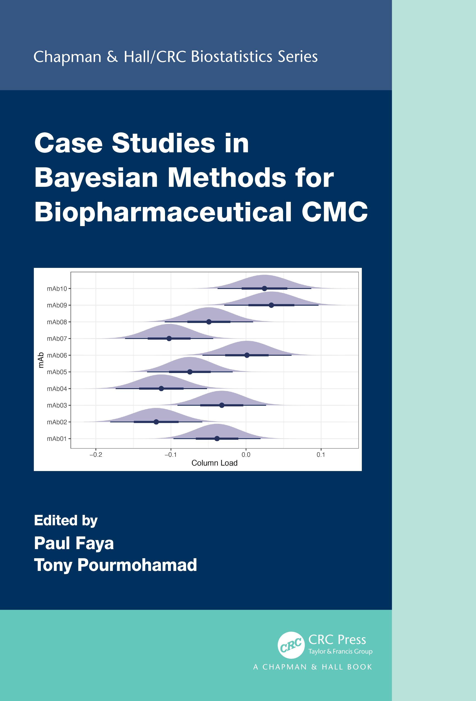

# Case Studies in Bayesian Methods for Biopharmaceutical CMC

 
  
The subject of this book is applied Bayesian methods for chemistry, manufacturing, and control (CMC) studies in the biopharmaceutical industry. The book has multiple authors from industry and academia, each contributing a case study (chapter). The collection of case studies covers a broad array of CMC topics, including stability analysis, analytical method development, specification setting, process development and optimization, process control, experimental design, dissolution testing, and comparability studies. The analysis of each case study includes a presentation of code and reproducible output. This book is written with an academic level aimed at practicing nonclinical biostatisticians, most of whom have graduate degrees in statistics.

- First book of its kind focusing strictly on CMC Bayesian case studies
- Case studies with code and output
- Representation from several companies across the industry as well as academia
- Authors are leading and well-known Bayesian statisticians in the CMC field
-  Accompanying website with code for reproducibility
- Reflective of real-life industry applications/problems

For more details about the book, please go to the following: https://doi.org/10.1201/9781003255093
